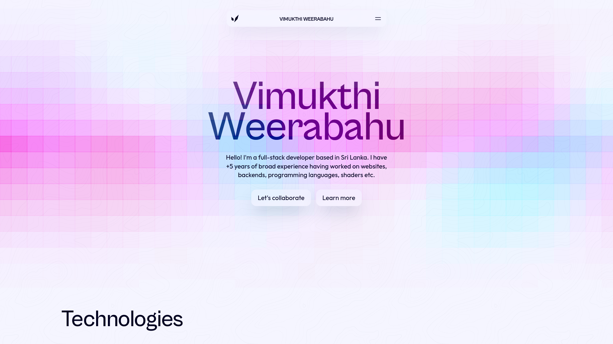

# Portfolio V3



This repository contains the source code of the third (public) iteration of my portfolio website.

## Build Instructions

Copy the `example.env` file to `.env` and fill in the variables. Afterwards execute the following commands:
```sh
pnpm install
pnpm run build
```
