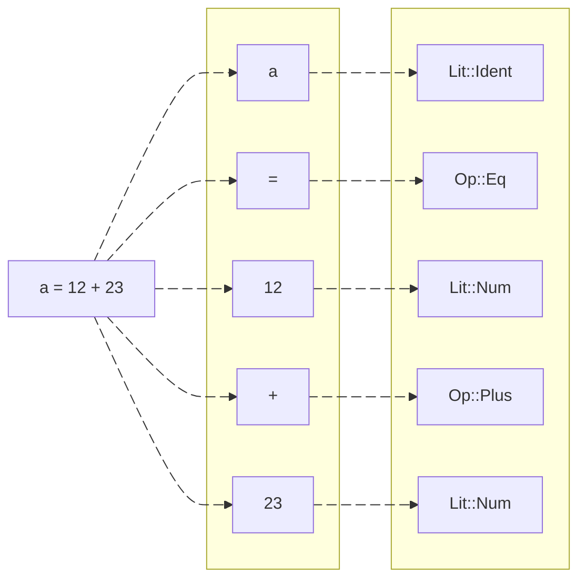
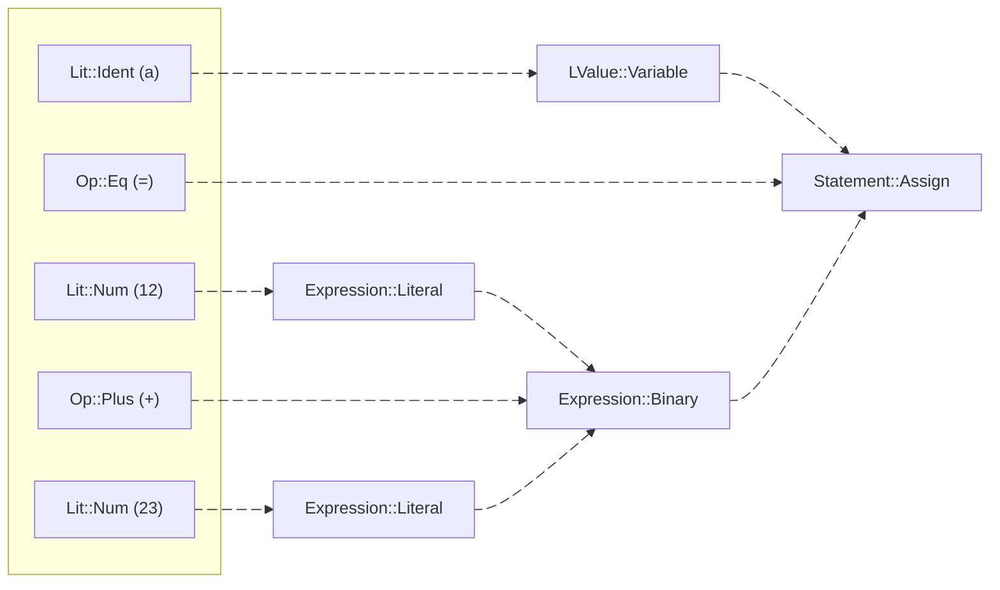

import HeroImg from "./hero.png?img";
import AmbiguousImg from './ambiguous.png?img';
import ContradictionImg from './contradiction.png?img';
import ExpressionIfImg from './expression-if.png?img';
import DeadCodeImg from './dead-code.png?img';
import InfiniteImg from './infinite.png?img';
import UnterminatedImg from './unterminated.png?img';
import ParseErrorImg from './parse-error.png?img';
import CompilerSVG from "../../../svgs/compiler";
import InferenceSVG from "../../../svgs/inference";

export const date = { year: 2021, month: 9 };
export const title = "Ares";
export const description =
  "A compiled programming language which aims to be a pleasant combination of Rust and TypeScript.";
export const hero = { type: "image", src: HeroImg, position: "center" };
export const color = ["#00a6b5", "#00ffc1"];
export const tags = ["Programming Language", "Compiler", "Rust", "LLVM"];

Ares is a [statically typed](https://stackoverflow.com/a/1517670/10685858) [compiled](https://wikipedia.org/wiki/Compiler) programming language. Its compiler is written in Rust and uses [LLVM](https://llvm.org) as the compiler backend.

Many language features of Ares are inspired by Rust. *TypeScript most influenced the vision of the language's type system.

<Footnote>
	*Unfortunately the envisioned type system isn't fully implemented as of writing this. For example union types (a feature that [TypeScript has](https://www.typescriptlang.org/docs/handbook/2/everyday-types.html#union-types) but not Rust, not to be confused with [Rust's `enum`s](https://doc.rust-lang.org/std/keyword.enum.html) which are fundamentally different) are supported by the type checker, however they are not supported at the final LLVM codegen step of the compiler and the language lacks the syntax to express such types.
</Footnote>

### An example program

<Video className="shadow-2xl/10!" src="/video/julia.mp4"/>

The program prompts the user for the maximum iteration depth and render resolution. It then proceeds to render a part of the [Julia set](https://wikipedia.org/wiki/Julia_set) to the output using the provided values.

<Code language="ares" filename="julia.ares" description output={null}>
```ares
// Compute a point in the Julia set
fn compute_point(
  x: Float,
  y: Float,
  max_iterations: Int
) -> Float {
  let cx = -0.7269;
  let cy = 0.1889;
  let i = 0;
  loop {
    let xs = x * x;
    let ys = y * y;
    if i >= max_iterations or xs + ys > 10.0 {
      break i.to_float() / max_iterations.to_float();
    }
    let x_temp = xs - ys;
    y = 2.0 * x * y + cy;
    x = x_temp + cx;
    i = i + 1;
  }
}

// Render a point in the Julia set
fn render_point(
  x: Float,
  y: Float,
  characters: Array<String>,
  max_iterations: Int
) -> String {
  let point = compute_point(x, y, max_iterations);
  let len = characters.len().to_float();
  let index = (point * len).ceil().to_int() - 1;
  characters[index]
}

// Map the render coordinates
fn scale(
  x: Int,
  render_size: Int,
  center: Float,
  size: Float
) -> Float {
  let start = center - (size / 2.0);
  let x = x.to_float() / (render_size - 1).to_float();
  start + x * size
}

fn main() {
  let center_x = 0.0;
  let center_y = 0.0;
  let width = 3.5;
  let height = 1.75;
  let characters = [".", ",", ":", ";", "!", "O", "#", "@"];

  println("");
  println(" ╭────────────────────╮");
  println("═╡ Julia Set Renderer │");
  println(" ╰────────────────────╯");
  println("");

  // Retrieve render configuration
  let msg = "═╡ Maximum number of iterations?";
  let max_iterations = prompt(msg);
  println("");
  let msg = "═╡ Width of the render?";
  let render_width = prompt(msg);
  println("");
  let msg = "═╡ Height of the render?";
  let render_height = prompt(msg);
  println("");

  // Render the Julia set
  let y = render_height - 1;
  loop {
    if y < 0 { break; }
    let x = 0;
    loop {
      if x >= render_width { break; }
      let character = render_point(
        scale(x, render_width, center_x, width),
        scale(y, render_height, center_y, height),
        characters,
        max_iterations
      );
      print(character);
      x = x + 1;
    }
    println("");
    y = y - 1;
  }
}
```
</Code>
<MediaDescription>Source code of the program.</MediaDescription>

Many features of the language are being exercised in the program, some of which include;

- Control flow (`if .. {..}` and `loop {..}`),
- Functions (`fn ..(..) -> .. {..}`),
- Input / Output (`prompt(..)`, `print(..)` and `println(..)`),
- Built-in functions (`.to_float()`, `.len()`, `.ceil()`, etc.),
- Data types (`Int`s, `Float`s, `Array`s, etc.)
- Type inference, etc.

### Open source

Ares is fully open source. The source is available on GitHub.

<GitHub name="Ares" description="What would Rust with the simplicity of TypeScript look like? This is my take." owner="VimHax" repo="Ares" endColor="#00ffc1"/>

## Type inference

Ares is a [statically typed](https://stackoverflow.com/a/1517670/10685858) language, therefore the compiler must know the data types of all data present in a program before being able to fully compile it.

The user is always able to explicitly annotate data types (and sometimes this is mandatory), however in most scenarios the compiler is able to infer the data types automatically by analyzing the flow of the data throughout the program.

### Explicit annotations

<Code language="ares" filename="annotated.ares" output={["A string.", "2"]}>
```ares
fn main() {
  let x: String = "A string.";
  println(x);

  let arr: Array<Int> = [3, 2, 1];
  let x: Int = arr[1];
  println(x);
}
```
</Code>

This program explicitly annotates `x` and `arr` but this information can be trivially inferred by the compiler, making the annotations unnecessary.

### Automatic inference

<Code language="ares" filename="inferred.ares" output={["A string.", "2"]}>
```ares
fn main() {
  //           ╭ is a `String` literal
  let x = "A string.";
  //  ╰ `x` is inferred to be a `String`

  println(x);

  //        ╭ is an `Array<_>` literal
  //        │╭──┬──┬─ the elements are `Int` literals
  let arr = [3, 2, 1];
  //   ╰ `arr` is inferred to be an `Array<Int>`

  //       ╭ is an `Array<Int>`
  //       │ ╭ is an array index operation
  let x = arr[1];
  //  ╰ `x` is inferred to be an `Int`

  println(x);
}
```
</Code>

This is the same program as [`annotated.ares`](#annotated.ares) but with the annotations omitted. The compiler has no trouble inferring the types of `x` and `arr` on its own.

### Ambiguities

But as established, sometimes the compiler does require annotations to be able to resolve all the data types.

<Code language="ares" filename="ambiguous.ares" error output={null}>
```ares
fn main() {
  let arr = [];
  println(arr.len());
}
```
</Code>

<PaddedImage src={AmbiguousImg} />

The compiler is having trouble inferring the type of `arr` because its element type is ambiguous (indicated with `?`). Regardless of the fact that `arr`'s elements are never accessed, all ambiguous types need to be resolved.

### Contradictions

It is possible for the compiler to infer contradicting information, these situations must also be resolved.

<Code language="ares" filename="contradiction.ares" error output={null}>
```ares
fn main() {
  let x = "Hi";
  let y = true;
  x = y;
}
```
</Code>

<PaddedImage src={ContradictionImg} />

Here `x` and `y` were inferred to be a `String` and `Boolean`, respectively. `Boolean`s cannot be assigned to `String`s so the compiler emits an error.

## Expression statements

In places where the expressions are expected, for example `let <name> = <expr>`, Ares allows statements as well.

### Blocks

<Code language="ares" filename="expression_block.ares" output={['1', '2', '3']}>
```ares
fn main() {
  let x = {
    let a = 1;
    let b = 2;
    println(a);
    println(b);
    // the block evaluates to the sum
    a + b
  };
  // `a` and `b` are no longer in scope
  println(x);
}
```
</Code>

Notice that the last expression at line `8` is not followed by a `;`, this is what tells Ares the block resolves to the value of that expression.

If a `;` was present `x` would instead have type `Void`.

### If statements

<Code language="ares" filename="expression_if.ares" error output={null}>
```ares
fn main() {
  let a = true;
  let b = false;

  let x = if a { 2.0 }
  else if b { 3.0 }
  else { "3" };

  println(x);
}
```
</Code>

<PaddedImage src={ExpressionIfImg} />

For statements where there are multiple points of resolution it needs to be ensured that they all have matching data types.

### Loop statements

<Code language="ares" filename="expression_loop.ares" output={['An integer? -3', 'Integer less than zero.', 'An integer? 4', '4']}>
```ares
fn main() {
  println(loop {
    let n = prompt("An integer?");
    if n >= 0 { break n; }
    println("Integer less than zero.");
  });
}
```
</Code>

When it comes to `loop`s, they resolve to the value provided to the `break` that caused it to stop looping.

## Exit status

During type inference Ares also analyzes the exit statuses of expressions. Knowledge of the exit statuses allows detection of erroneous dead code and allows assigning the special `Never` type.

### Dead code

<Code language="ares" filename="dead_code.ares" error output={null}>
```ares
fn main() {
  return;
  println("Hello.");
  println("World.");
}
```
</Code>

<PaddedImage src={DeadCodeImg} />

In this example, the compiler is able to deduce that line `3-4` are unreachable due to the `return` on line `2`.

### Never type

<Code language="ares" filename="never.ares" output={['2.0']}>
```ares
fn main() {
  let a = true;
  let b = false;

  let x = if a { 2.0 }
  else if b { 3.0 }
  else { return; };
  //   ╰────┬────╯
  //     `Never`

  println(x);
}
```
</Code>

This example is a modified version of [`expression_if.ares`](#expression_if.ares) where the `else` branch now contains a `return`.

The `else` block is assigned the `Never` type. Since the `Never` type is able to coerce in to any other data type this modified program no longer contains a contradiction.

### Required returns

<Code language="ares" filename="infinite.ares" error output={null}>
```ares
fn infinite() -> Int {
  println("Hello!");
  loop {
    println("Hi!");
  }
}

fn main() {}
```
</Code>

<PaddedImage src={InfiniteImg} />

Since `infinite` has `Int` as its return type the compiler expects that the function body always returns an `Int` in a finite amount of time.

## Implementation

Ares is a compiled language. The compiler is written in Rust and it uses [LLVM](https://llvm.org) for the compiler backend. The compiler design is fairly standard. It is composed of a lexer, parser, analyzer and code generator.

<Diagram description>
  <CompilerSVG />
</Diagram>
<MediaDescription>All the stages of the Ares compiler.</MediaDescription>

### Lexer

The lexer transforms the characters that comprise the source code to tokens. Tokens are the atomic units of the Ares syntax.

<Diagram description>

</Diagram>
<MediaDescription>The transformation of `a = 12 + 23` to tokens.</MediaDescription>

Each transformed token stores its location in the source code. This metadata is used for error reporting. When an error is found the compiler provides the user with the exact whereabouts of it, improving the user experience.

At this stage basic syntax errors are caught by the lexer. For example `String` literals with missing end quotes, `"Hello World!`. However `a = 12 + = 23` will not be flagged by the lexer as all the individual tokens are valid.

<PaddedImage src={UnterminatedImg} />

### Parser

The parser transforms the tokens to an **A**bstract **S**yntax **T**ree. The AST represents the entire Ares program as a tree data structure.

<Diagram description>

</Diagram>
<MediaDescription>The AST of `a = 12 + 23`.</MediaDescription>

Akin to the lexer, the parser calculates and stores the source code locations for all the AST nodes. *To calculate the location of a node the parser typically takes the starting position of the first child token / node and the ending position of the last child token / node.

The parser understands the entirety of the Ares syntax and is therefore able to catch all the syntax errors the lexer may have missed. For example the syntax error in `a = 12 + = 23`, which the lexer misses, is instead caught by the parser.

<PaddedImage src={ParseErrorImg} />

Both the lexer, and in extension the parser, ignore whitespaces and comments in the source code entirely. For the current scope of Ares this is acceptable, however this decision means the AST is unable to power a hypothetical automatic code formatter (or at least do it well).

<Footnote>
  *For the `Statement::Assign` in the diagram that would mean the starting position of `LValue::Variable` (which itself is the starting position of `Lit::Ident`) and the ending position of `Expression::Binary` (which itself is the ending position of `Expression::Literal`, which itself is the ending position of `Lit::Num`).
</Footnote>

### Analyzer

*The analyzer's goal is to understand enough of the program to be able to verify the integrity of it.

<Footnote>
  *To challenge myself I intentionally did not look at any approaches taken by other languages to tackle this part of the compiler. Therefore the approach that I took is my own and has not been battle tested or anything like that.
  
  For brevity the following sections only present an overview of the type inference part of the analyzer and excludes how exit statuses are computed. For the same reason the information provided may also not be fully technically accurate, only a simplified picture is provided to motivate the inference algorithm.
</Footnote>

#### Representing uncertainty

A data type is internally referred to as being "certain" if it is fully known. If the analyzer is unable to resolve all uncertainty an error will be emitted.

The unknown type, `?`, is used as placeholder for a certain type when it is currently fully unknown. During analysis when enough information is inferred these unknowns will be replaced with their certain types. Every unknown type is associated with a unique identifier to be able to link the same unknown to constraints or other types (this will be visualized as `?a`, `?x`, `?1`, etc.).

The possibility type, `T || U || V || ...`, is a step up from the unknown type. This type represents multiple candidate types, one of which must be the underlying certain type. During analysis these possibilities will also be reduced away to certain types.

#### Relationships between types

Being able to represent uncertainty isn't enough for inference, the relationships between types need to be utilized. This is the purpose constraints serve.

A constraint consists of 2 types, `<LHS type> = <RHS type>`. To satisfy a constraint the **R**ight **H**and **S**ide type needs to be assignable to the **L**eft **H**and **S**ide type. Or in other words, a constraint is satisfied if data of `RHS type` can be assigned to a variable of `LHS type`.

#### Gathering initial information

The analyzer stores all the types it constructs in a list. It also keeps track of all constraints that need to be upheld in another list.

The analyzer traverses the AST where it constructs certain types (`Int`s, `Float`s, `Boolean`s, etc) for literals and constructs unknowns or possibilities for the rest (variables, array elements, expression statements, etc.). Constraints are added in the following scenarios (not exhaustive);

- `a = b`, here `<type of a> = <type of b>` is added,
- `let x: String = y`, here `String = <type of y>` is added,
- `arr[idx]`, here `Int = <type of idx>` and `Array<?> = <type of arr>` is added,
- `a + b`, here `?x = <type of a>`, `?x = <type of b>` and `Int || Float = ?x` is added, etc.

All the starting information necessary to eventually resolve all uncertainty should now be available in the gathered lists of types and constraints.

#### Making inferences

Inference is performed iteratively. New information is inferred in each iteration, which is then used in the upcoming iterations to further reduce uncertainty. The iteration stops when no more progress can be made.

<Diagram>
  <InferenceSVG />
</Diagram>

At the beginning of every iteration the analyzer expands all the types to ease the next step. Here are some examples;

- `A || (B || C)` is expanded to `A || B || C`,
- `Array<A || B>` is expanded to `Array<A> || Array<B>`,
- `Fn(A || B, C || D) -> Void` is expanded to `(Fn(A, C) -> Void) || (Fn(A, D) -> Void) || (Fn(B, C) -> Void) || (Fn(B, D) -> Void)`, etc.

After expansion the analyzer iterates through all the constraints and checks if they are satisfied. If any of them aren't a `CONTRADICTION` error is emitted. During the satisfaction checks assertions are made and invalid possibilities are marked for removal. Some examples of this;

- `Int = ?x`, `?x` is asserted to be an `Int`,
- `Fn(?x) -> Void = Fn(String) -> Void`, `?x` is asserted to be a `String`,
- `Int || Float = Boolean || Float`, `Int` and `Boolean` possibilities are marked for removal, etc.

At the end of each iteration the analyzer removes the invalid possibilities and satisfies the assertions by substituting the unknowns with the asserted types.

Finally, when an iteration results in no new assertions and no new possibilities marked for removal it means no more progress can be made, so the loop stops. If at this point any uncertainty still remains an `AMBIGUOUS` error is emitted.

#### An example of inference

The comments below use `_` to represent unknowns which are trivially inferred and are therefore not particularly relevant to understanding the inferences made.

<Code language="ares" filename="inference.ares" output={["0"]}>
```ares
fn main() {
  //          ╭ is an `Array<_>` literal
  let arr_a = [];
  //    ╰ `arr_a` is inferred to be an `Array<?a>`

  //          ╭ is an `Array<_>` literal
  let arr_b = [];
  //    ╰ `arr_b` is inferred to be an `Array<?b>`

  if false {
    let x = arr_a[0];
    //  ╰ `x` is inferred to be ?a

    x = arr_b[0];
    //     ╰ ?b must be assignable to ?a, therefore;
    //       (1.) ?a = ?b

    println(x.len());
    //         ╰ `len` can only be called on `String`s
    //           or `Array<_>`s, therefore;
    //           (2.) String || Array<_> = ?a

    println(x);
    //      ╰ `println` can only be called with `Int`s,
    //        `Float`s, `Boolean`s and `String`s, therefore;
    //        (3.) Int || Float || Boolean || String = ?a
  }

  println(arr_a.len());
}
```
</Code>

The analyzer has gathered the following constraints;

1. `?a = ?b`
2. `String || Array<_> = ?a`
3. `Int || Float || Boolean || String = ?a`

Looking at `2.` and `3.` we can infer that `?a` must be the intersection of both the left hand side types, `(String || Array<_>) & (Int || Float || Boolean || String)`, which is just `String`. With this a new constraint can be inferred;

4. `String = ?a` (inferred)

The only type that can be assigned to a `String` is yet another `String`, therefore `?a` must be a `String`. Now `1.` can be used, where substituting `?a` results in the following new inferred constraint;

5. `String = ?b` (inferred)

Reusing the same idea it must be the case that `?b` is also a `String`. And with that all uncertainty has been resolved and the program successfully compiles!

### Code generator

The code generator traverses the AST (which at this point is enriched with data types) to produce LLVM IR. Lets take a look at what the generated IR looks like for the following program.

<Code language="ares" filename="llvm_ir.ares" output={["3", "2", "5", "6.6"]}>
```ares
fn sum(a: Int, b: Int) -> Int {
  a + b
}

fn calling_a_function() {
  let a = 1;
  let b = 2;
  let c = sum(a, b);
  println(c);
}

fn indexing_an_array() {
  let arr = [3, 2, 1];
  let element = arr[1];
  println(element);
}

fn getting_the_length() {
  let str = "Hello";
  let length = str.len();
  println(length);
}

fn looping() {
  let count = 0;
  let x = loop {
    if count > 3 {
      break count.to_float() * 1.1;
    }
    count = count + 3;
  };
  println(x);
}

fn main() {
  calling_a_function();
  indexing_an_array();
  getting_the_length();
  looping();
}
```
</Code>

<Code language="llvm" filename="llvm_ir.ll" output={null}>
```llvm
; ModuleID = 'program'
source_filename = "program"

%String = type { i64, i8* }
%Array = type { i64, i64, i8* }

@static-str = private unnamed_addr constant [6 x i8] c"Hello\00", align 1

declare double @floor_float(double %0)

declare double @ceil_float(double %0)

declare double @round_float(double %0)

declare i64 @prompt_int(%String %0)

declare double @prompt_float(%String %0)

declare i64 @len_string(%String %0)

declare i64 @len_array(%Array* %0)

declare i64 @index_of_int(%Array* %0, i64 %1)

declare double @index_of_float(%Array* %0, i64 %1)

declare i1 @index_of_boolean(%Array* %0, i64 %1)

declare %String @index_of_string(%Array* %0, i64 %1)

declare void @print_int(i64 %0)

declare void @print_float(double %0)

declare void @print_boolean(i1 %0)

declare void @print_string(%String %0)

declare void @println_int(i64 %0)

declare void @println_float(double %0)

declare void @println_boolean(i1 %0)

declare void @println_string(%String %0)

define i64 @sum(i64 %0, i64 %1) {
entry:
  %a = alloca i64, align 8
  store i64 %0, i64* %a, align 4
  %b = alloca i64, align 8
  store i64 %1, i64* %b, align 4
  %var = load i64, i64* %a, align 4
  %var1 = load i64, i64* %b, align 4
  %expr = add i64 %var, %var1
  ret i64 %expr
}

define void @calling_a_function() {
entry:
  %a = alloca i64, align 8
  store i64 1, i64* %a, align 4
  %b = alloca i64, align 8
  store i64 2, i64* %b, align 4
  %c = alloca i64, align 8
  %var = load i64, i64* %a, align 4
  %var1 = load i64, i64* %b, align 4
  %res = call i64 @sum(i64 %var, i64 %var1)
  store i64 %res, i64* %c, align 4
  %var2 = load i64, i64* %c, align 4
  call void @println_int(i64 %var2)
  ret void
}

define void @indexing_an_array() {
entry:
  %arr = alloca %Array, align 8
  %expr = alloca [3 x i64], align 8
  store [3 x i64] [i64 3, i64 2, i64 1], [3 x i64]* %expr, align 4
  %cast = getelementptr [3 x i64], [3 x i64]* %expr, i32 0, i32 0
  %cast1 = bitcast i64* %cast to i8*
  %expr2 = insertvalue %Array { i64 3, i64 ptrtoint (i64* getelementptr (i64, i64* null, i32 1) to i64), i8* poison }, i8* %cast1, 2
  store %Array %expr2, %Array* %arr, align 8
  %element = alloca i64, align 8
  %var = load %Array, %Array* %arr, align 8
  %res = alloca %Array, align 8
  store %Array %var, %Array* %res, align 8
  %res3 = call i64 @index_of_int(%Array* %res, i64 1)
  store i64 %res3, i64* %element, align 4
  %var4 = load i64, i64* %element, align 4
  call void @println_int(i64 %var4)
  ret void
}

define void @getting_the_length() {
entry:
  %str = alloca %String, align 8
  store %String { i64 5, i8* getelementptr inbounds ([6 x i8], [6 x i8]* @static-str, i32 0, i32 0) }, %String* %str, align 8
  %length = alloca i64, align 8
  %var = load %String, %String* %str, align 8
  %res = call i64 @len_string(%String %var)
  store i64 %res, i64* %length, align 4
  %var1 = load i64, i64* %length, align 4
  call void @println_int(i64 %var1)
  ret void
}

define void @looping() {
entry:
  %count = alloca i64, align 8
  store i64 0, i64* %count, align 4
  %x = alloca double, align 8
  %loop-eval = alloca double, align 8
  br label %loop

loop:                                             ; preds = %if-finally, %entry
  %var = load i64, i64* %count, align 4
  %int-cmp = icmp sgt i64 %var, 3
  br i1 %int-cmp, label %then, label %if-finally

loop-finally:                                     ; preds = %then
  %loop4 = load double, double* %loop-eval, align 8
  store double %loop4, double* %x, align 8
  %var5 = load double, double* %x, align 8
  call void @println_float(double %var5)
  ret void

then:                                             ; preds = %loop
  %var1 = load i64, i64* %count, align 4
  %res = sitofp i64 %var1 to double
  %expr = fmul double %res, 1.100000e+00
  store double %expr, double* %loop-eval, align 8
  br label %loop-finally

if-finally:                                       ; preds = %loop
  %var2 = load i64, i64* %count, align 4
  %expr3 = add i64 %var2, 3
  store i64 %expr3, i64* %count, align 4
  br label %loop
}

define i32 @main() {
entry:
  call void @calling_a_function()
  call void @indexing_an_array()
  call void @getting_the_length()
  call void @looping()
  ret i32 0
}
```
</Code>

There are many declarations being made in the IR, these are references to helper functions written in C. This C library is effectively the "standard library" of Ares.

<Code language="c" filename="Ares/compiler/src/lib.c" output={null}>
```c
#include <stdio.h>
#include <stdbool.h>
#include <stdlib.h>
#include <math.h>

#ifndef __STDC_IEC_559__
#error "Requires IEEE 754 floating point!"
#endif

typedef long Int;
typedef double Float;
typedef bool Boolean;

typedef struct {
  Int len;
  const char* content;
} String;

typedef struct {
  Int len;
  Int element_size;
  const void* content;
} Array;

Float floor_float(Float f) {
  return floor(f);
}

Float ceil_float(Float f) {
  return ceil(f);
}

Float round_float(Float f) {
  return round(f);
}

void print_int(Int i) {
  printf("%li", i);
}

void print_float(Float f) {
  printf("%f", f);
}

void print_boolean(Boolean b) {
  if (b) printf("true");
  else printf("false");
}

void print_string(String s) {
  printf("%s", s.content);
}

void println_int(Int i) {
  print_int(i);
  printf("\n");
}

void println_float(Float f) {
  print_float(f);
  printf("\n");
}

void println_boolean(Boolean b) {
  print_boolean(b);
  printf("\n");
}

void println_string(String s) {
  print_string(s);
  printf("\n");
}

Int prompt_int(String s) {
  Int i;
  println_string(s);
  scanf("%ld", &i);
  return i;
}

Float prompt_float(String s) {
  Float f;
  println_string(s);
  scanf("%lf", &f);
  return f;
}

Int len_string(String s) {
  return s.len;
}

Int len_array(Array* a) {
  return a->len;
}

void exit_if_out_of_bounds(Array* a, Int idx) {
  if (idx < 0 || idx >= a->len) {
    printf("ILLEGAL OUT OF BOUNDS ARRAY INDEX - LENGTH: %li, INDEX: %li\n", a->len, idx);
    exit(1);
  }
}

Int index_of_int(Array* a, Int idx) {
  exit_if_out_of_bounds(a, idx);
  long ptr = ((long) a->content + a->element_size * idx);
  return *((Int*) ptr);
}

Float index_of_float(Array* a, Int idx) {
  exit_if_out_of_bounds(a, idx);
  long ptr = ((long) a->content + a->element_size * idx);
  return *((Float*) ptr);
}

Boolean index_of_boolean(Array* a, Int idx) {
  exit_if_out_of_bounds(a, idx);
  long ptr = ((long) a->content + a->element_size * idx);
  return *((Boolean*) ptr);
}

String index_of_string(Array* a, Int idx) {
  exit_if_out_of_bounds(a, idx);
  long ptr = ((long) a->content + a->element_size * idx);
  return *((String*) ptr);
}
```
</Code>

This LLVM IR is then used to generate object code for a target machine, such as `x86_64-pc-linux-gnu`. Finally this object code is linked with the helper library to generate the executable.

#### Reproducing the executable

Both the LLVM IR and the C library above are presented as-is, meaning they can actually be used to reproduce the executable the Ares compiler would have. To achieve this we will mirror the what the compiler does automatically.

<Code language="shell" filename="compile.sh" output={["3", "2", "5", "6.6"]}>
```shell
$ llc llvm_ir.ll --filetype=obj # Generate object code
$ clang llvm_ir.o lib.c -lm -o llvm_ir # Link object code
$ ./llvm_ir
```
</Code>
