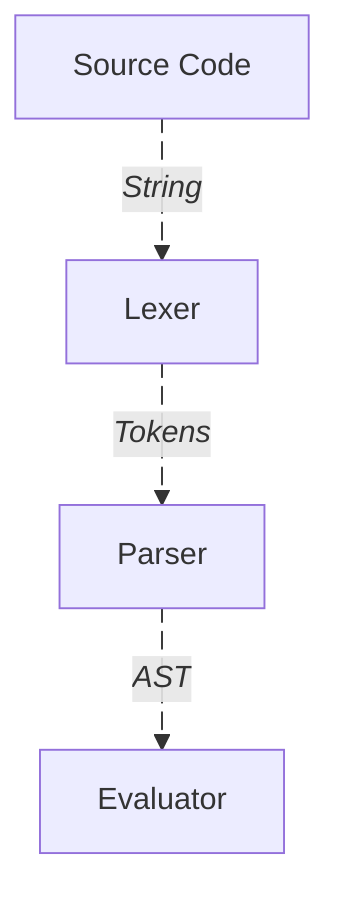
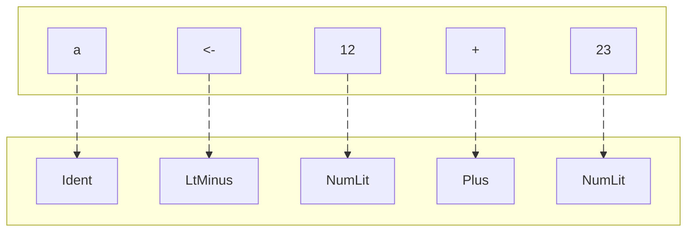
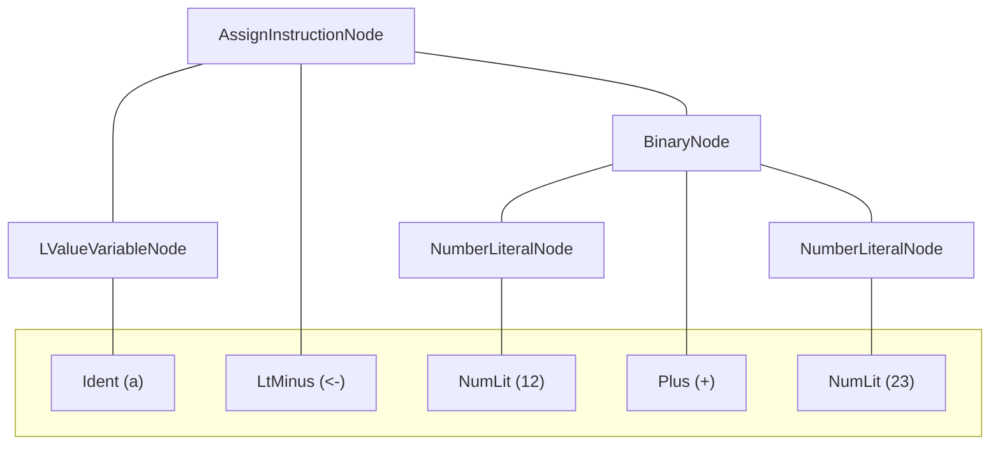

import HeroImg from "./hero.png";
import CompetitionImg from "./competition.png";
import LexerImg from './lexer.png';
import ParserImg from './parser.png';
import Evaluator1Img from './evaluator-1.png';
import Evaluator2Img from './evaluator-2.png';

export const date = { year: 2020, month: 8 };
export const title = "Eelios";
export const description =
  "Created a programming language based on a gimmick in approximately 2 weeks for a competition.";
export const hero = { type: "image", src: HeroImg, position: "bottom" };
export const color = ["#14a100", "#c2ff00"];
export const tags = ["Programming Language", "TypeScript"];

Eelios is a [dynamically typed](https://stackoverflow.com/a/1517670/10685858) [interpreted](<https://wikipedia.org/wiki/Interpreter_(computing)>) programming language. The interpreter is written in TypeScript without any major dependencies and uses Node.js for the runtime.

### An example program

<Video src="/video/mandelbrot.mp4"/>

The program prompts the user for the maximum iteration depth and render resolution. It then proceeds to render a part of the [Mandelbrot set](https://wikipedia.org/wiki/Mandelbrot_set) to the output using the provided values.

<Code language="eelios" filename="mandelbrot.ee" description output={null}>
```eelios
[
  centerX <- -0.75,
  centerY <- 0,
  width <- 3.5,
  height <- 2,
  characters <- [".", ",", ":", ";", "!", "O", "#", "@"],

  # Only defined for x >= 0
  floor <- | x: Number | -> Number eval x - (x % 1),
  ceil <- ( x: Number ) => Number [
    if x = floor(x) then eval x
    else eval floor(x) + 1
  ],

  # Get a number from the user
  getNumber <- | message: String | -> Number [
    n <- 0,
    valid <- false,
    while valid = false do [
      number <- input(message),
      if (isNumber(number)) & (toNumber(number)) > 0 then [
        valid <- true,
        n <- toNumber(number)
      ] else [
        print "Please try again."
      ]
    ],
    eval n
  ],

  # Retrieve render configuration
  maxIterations <- getNumber("Maximum number of iterations?"),
  renderWidth <- getNumber("Width of the render?"),
  renderHeight <- getNumber("Height of the render?"),

  # Compute a point
  computePoint <- ( pointX: Number, pointY: Number ) => Number [
    x <- 0,
    y <- 0,
    i <- 0,
    while i < maxIterations & x ^ 2 + y ^ 2 <= 2 ^ 2 do [
      xTemp <- x ^ 2 - y ^ 2 + pointX,
      y <- 2 * x * y + pointY,
      x <- xTemp,
      i <- i + 1
    ],
    eval i / maxIterations # 0 < x <= 1
  ],

  # Render a point
  startX <- centerX - (width / 2),
  startY <- centerY + (height / 2),
  renderPoint <- ( renderX: Number, renderY: Number ) => String [
    x <- startX + renderX / (renderWidth - 1) * width,
    y <- startY - renderY / (renderHeight - 1) * height,
    point <- computePoint(x, y),
    index <- ceil(point * len(characters)) - 1,
    eval characters[index]
  ],

  # Render the mandelbrot set
  y <- 0,
  while y < renderHeight do [
    line <- "",

    # Render a line
    x <- 0,
    while x < renderWidth do [
      character <- renderPoint(x, y),
      line <- line + character,
      x <- x + 1
    ],
    print line,

    y <- y + 1
  ]
]
```
</Code>
<MediaDescription>Source code of the program.</MediaDescription>

Many features of the language are being exercised in the program, some of which include;

- Control flow (`if..then..else` and `while..do`),
- Functions and closures (`| .. | -> ..` and `( .. ) => ..`),
- Input / Output (`input ..` and `print ..`),
- Unary and binary operators (`+`, `-`, `<=`, `&`, etc.),
- Built-in functions* (`isNumber`, `toNumber`, `len`, etc.),
- Data types (`String`s, `Number`s, `Array`s), etc.

<Footnote>
  *These are technically `Instruction`s, but they will be referred to as functions as they indistinguishable from each other for the most part. The only exception is how the parser handles these differently, quirks of which are observable on line `21` of the `mandelbrot.ee` program where the `Instruction`s need to be wrapped in parentheses to nudge the parser in the right direction.
</Footnote>

### Open source

Eelios is fully open source. The source is available on GitHub. The `README.md` contains comprehensive documentation of the language.

<GitHub name="Eelios" description="A fancy pants programming language." owner="VimHax" repo="Eelios" color="#c2ff00"/>
{/* <GitHub name="Ares" description="What would Rust with the simplicity of TypeScript look like? This is my take." owner="VimHax" repo="Ares" color="#00ffc1"/> */}

## The jam

I came across a [programming language jam by Replit](https://web.archive.org/web/20200817153909/https://repl.it/jam). The spirit of the jam was to "bring fresh and wild ideas to programming languages". This was the opportunity I capitalized on to create this language.

<Image src={CompetitionImg} />

## The gimmick

Eelios programs are composed of `Instruction`s (typically referred to as "statements" in other languages). However, unlike in other languages, `Instruction`s are treated as data in Eelios, data which can be manipulated at runtime.

<Code language="eelios" filename="gimmick.ee" output={["World"]}>
```eelios
[
  instruction <- print "World", # does NOT execute
  #    ╰ data type of this variable is `Instruction`
  print "Hello",
  instruction # prints "World" to the output
]
```
</Code>

### What is an Eelios program?

An `Instruction` in Eelios is either just a single `Instruction` (like `input "Your name?"`) or an array of `Instruction`s (like `[a <- "A", print a]`). A hypothetical definition of the `Instruction` data type in TypeScript would look something like the following;

<Code language="ts" filename="instruction.d.ts" description output={null}>
```ts
type Instruction = Instruction | Array<Instruction>;
```
</Code>
<MediaDescription>Note that this is a recursive definition.</MediaDescription>

An Eelios program, as a whole, is defined to simply be an `Instruction`. Observe that all Eelios programs presented so far are arrays of `Instruction`s, which is perfectly acceptable according to the definition of an `Instruction`.

<Code language="eelios" filename="single.ee" description output={["Hi"]}>
```eelios
print "Hi"
```
</Code>
<MediaDescription>This is a valid Eelios program.</MediaDescription>

<Code language="eelios" filename="recursive.ee" description output={["A", "B", "C"]}>
```eelios
([print "A", [[print "B", ([])], print "C"]])
```
</Code>
<MediaDescription>So is this, it uses the recursive nature of the definition.</MediaDescription>

Eelios runs the program by executing the top level `Instruction` (which is the whole program). If the `Instruction` is an array, Eelios executes each sub-`Instruction` in order. As demonstrated by the `gimmick.ee` program, Eelios does not execute `Instruction`s that are not at the top level by default, instead they are treated as data which can potentially be stored, manipulated and executed later.

The choice of using `[]` (instead of the far more common `{}`) for scopes in Eelios was not for cosmetic purposes, but rather to highlight that these truly are actually just arrays of `Instruction`s that are being executed.

### Functions and closures

Functions in Eelios are written in the format: `| .. | -> .. <Instruction>`. The parameters are written in between the `||` with their corresponding data type. The return type of the function is written after the `->` which is immediately followed by the function body, an `Instruction`. The `eval` `Instruction` is used to return a value from the function (it is effectively `return` in other languages).

<Code language="eelios" filename="function_syntax.ee"  output={["This is the function body, which is an Instruction", "These are executed when the function gets called", "5"]}>
```eelios
[
  # Here's a simple `add` function.
  add <- | a: Number, b: Number | -> Number [
    print "This is the function body, which is an Instruction",
    print "These are executed when the function gets called",
    eval a + b # this returns the sum of `a` and `b`
  ],
  print add(2, 3)
]
```
</Code>

The function body cannot access variables defined outside the function. If this behavior is desirable a closure can be used instead. Closures are instead written in the format `( .. ) => .. <Instruction>`.

<Code language="eelios" filename="closure_syntax.ee"  output={["1", "1", "3", "6"]}>
```eelios
[
  # Here's a simple `increment` closure.
  a <- 1,
  increment <- ( x: Number ) => Number [
    prevA <- a, # only accessible because this is a closure
    # print b,
    #    ╰ if uncommented this will error because
    #      `b` is being defined after the closure
    a <- a + x,
    eval prevA
  ],

  b <- 2,
  print a,
  print increment(b),
  print increment(3),
  print a
]
```
</Code>

### Exploring the landscape

The gimmick entails the existence of many unconventional programs in the landscape of all valid Eelios programs. Let's see what some of those look like!

#### Reorder execution

<Code language="eelios" filename="reorder_execution.ee" output={["1", "2"]}>
```eelios
[
  instructions <- [
    print a,
    a <- 1,
    a <- a + 1
  ],

  # instructions,
  #      ╰ if this was uncommented it would
  #        cause an error when attempting to
  #        print because `a` would not be
  #        defined yet

  reordered <- [
    instructions[1], # a <- 1
    instructions[0], # print a
    instructions[2], # a <- a + 1
    instructions[0]  # print a
  ],

  reordered
]
```
</Code>

Execution of `Instruction`s can be reordered programmatically. Notice how `print a` is able to refer to `a` even when it doesn't exist yet, this is further explored in the next program.

#### Variable references

<Code language="eelios" filename="variable_references.ee" output={["It should be 13", "Sum of x and y", "x + y: 13"]}>
```eelios
[
  # This function has no parameters and it returns an `Instruction`
  f <- || -> Instruction [
    # Note that there is no variable `x` or `y` in this scope
    eval [ print "Sum of x and y", print "x + y: " . x + y ]
  ],

  result <- f(),
  prediction <- print "It should be 13",
  instructions <- [prediction, result],

  x <- 6,
  y <- 7,
  instructions
]
```
</Code>

It's possible for `Instruction`s to reference variables that do not exist. Their existence only matters at the moment the `Instruction` that's referring to them gets executed.

#### Instructions within instructions

<Code language="eelios" filename="sub-instructions.ee" output={["3 is larger than or equal to 2"]}>
```eelios
[
  fnBody <- [
    eval print b . " is larger than or equal to " . a
  ],

  thenBody <- print a . " is larger than " . b,
  elseBody <- || -> Instruction fnBody,
  #           resolves to the eval ╯

  a <- 2,
  b <- 3,
  if a > b then thenBody else elseBody()
  #                ╰───────┬──────╯
  # resolves to the prints ╯
]
```
</Code>

The `if` `Instruction` is written in the format `if .. then <Instruction> else <Instruction>`. That means `if` potentially uses 2 other `Instruction`s as parameters. The above program uses this fact where instead of writing the `Instruction`s in place, as usual, they are provided at runtime.

The same idea is also used for setting the function body, in line `7`, at runtime.

#### Defining a function procedurally

<Code language="eelios" filename="procedural_function.ee" output={["i = 0, f(2) = 2", "i = 1, f(2) = 3", "i = 2, f(2) = 4", "i = 3, f(2) = 6"]}>
```eelios {13-18}
[
  noop <- if false then [], # this `Instruction` does nothing

  transform <- ( map: Boolean, x: Instruction ) => Instruction [
    if map then eval x else eval noop
  ],

  increment <- x <- x + 1,
  double <- x <- x * 2,

  i <- 0,
  while i < 4 do [
    body <- [
      transform(i % 2 = 1, increment),
      transform(i >= 2, double),
      eval x
    ],
    f <- | x: Number | -> Number body,

    print "i = " . i . ", f(2) = " . f(2),

    i <- i + 1
  ]
]
```
</Code>

Based on the value of `i` a function body is generated at runtime. It then attaches the body to a header to make a complete function and proceeds to call it.

The fact that functions cannot reference external variables is evidence that the function body is evaluated at line `14` and `15` (because if it wasn't an error would be raised that `body`, `transform`, `increment` or `double` is unreachable when the `f` is called).

## Implementation

Eelios is an interpreted language. The interpreter is written in TypeScript and it runs on the Node.js runtime. The interpreter design is fairly standard. It is composed of a lexer, parser and an evaluator.

<Diagram description>

</Diagram>
<MediaDescription>The processing Eelios does to the source code to execute it.</MediaDescription>

### Lexer

The lexer transforms the characters that comprise the source code to tokens. Tokens are the atomic units of the Eelios syntax.

<Diagram description>

</Diagram>
<MediaDescription>The transformation of `a <- 12 + 23` to tokens.</MediaDescription>

Each transformed token stores its location in the source code. This metadata is used for error reporting. When an error occurs the interpreter provides the user with the exact whereabouts of it, improving the user experience.

At this stage basic syntax errors are caught by the lexer. For example `String` literals with missing end quotes, `"Hello World!`. However `a <- 12 + <- 23` will not be flagged by the lexer as all the individual tokens are valid.

<Image className="aspect-1950/600" src={LexerImg} />

### Parser

The parser transforms the tokens to an **A**bstract **S**yntax **T**ree. The AST represents the entire Eelios program as a tree data structure.

<Diagram description>

</Diagram>
<MediaDescription>The AST of `a <- 12 + 23`.</MediaDescription>

Akin to the lexer, the parser calculates and stores the source code locations for all the AST nodes. *To calculate the location of a node the parser typically takes the starting position of the first child token / node and the ending position of the last child token / node.

The parser understands the entirety of the Eelios syntax and is therefore able to catch all the syntax errors the lexer may have missed. For example the syntax error in `a <- 12 + <- 23`, which the lexer misses, is instead caught by the parser.

<Image className="aspect-1950/750" src={ParserImg} />

Both the lexer, and in extension the parser, ignore whitespaces and comments in the source code entirely. For the scope of Eelios this is acceptable, however this decision means the current AST is unable to power a hypothetical automatic code formatter (or at least do it well).

<Footnote>
  *For the `AssignInstructionNode` in the diagram that would mean the starting position of `LValueVariableNode` (which itself is the starting position of `Ident`) and the ending position of `NumberLiteralNode` (which itself is the ending position of `NumLit`).
</Footnote>

### Evaluator

The evaluator attempts to execute the top level `Instruction` (which is what an Eelios program is) by traversing the AST.

<Code language="ts" filename="Eelios/src/evaluator/evaluator.ts" description output={null}>
```ts showLineNumbers=1160
public evaluate(): null | Value {
	return this.evaluateInstructionNode(this.instruction);
}
```
</Code>
<MediaDescription>This is the code which kicks of the evaluator to execute the whole program.</MediaDescription>

The evaluator operates in 2 modes, an `Instruction` evaluation mode (which is the initial mode) and an expression evaluation mode. Most behavior is shared between these modes, except what happens when the evaluator comes across an `Instruction`.

#### Instruction evaluation mode

In this mode, when the evaluator is traversing the AST it's expecting to come across `InstructionNode`s directly, which can be immediately resolved to an `Instruction`, or come across expression nodes which, after undergoing execution, result in an `Instruction`. If this expectation is met the evaluator proceeds to execute the resolved `Instruction` immediately. If unmet the evaluator exits with an error.

<Image className="aspect-2050/700" src={Evaluator1Img}>The error thrown when the expectation is unmet.</Image>

#### Expression evaluation mode

In this mode the evaluator executes expression nodes it comes across when traversing. If the evaluator is met with an `InstructionNode`, instead of immediately executing it (like in the `Instruction` evaluation mode) the `Instruction` is instead treated as data which it then bubbles back up. When `Instruction`s are being "treated as data" the evaluator stores a reference to the AST node which represents the `Instruction`.

<Image className="aspect-1650/450" src={Evaluator2Img}>The code which stores an `Instruction`.</Image>

#### Switching modes

The interpreter starts out in the `Instruction` evaluation mode and switches to the expression evaluation mode when data is expected to be produced (to either be stored in a variable, be a function argument, used for I/O, etc.). Once data is produced the interpreter switches back to the previous mode.

This is the fundamental difference between `Instruction`s and expressions, `Instruction`s do not produce any data (akin to `void` in other languages but Eelios does not have a `void` data type).

To see how the interpreter switches modes in practice all the points of interest in the simple `function_syntax.ee` program are marked below.

<Code language="eelios" filename="switching.ee" output={["5"]} description>
```eelios
#(1 Ins)
[
  #(2 Ins)
  add <-
    #(3 Expr)
    ( a: Number, b: Number ) => Number
      #(6 Ins)
      [
        #(7 Ins)
        sum <-
          #(8 Expr)
          a + b,
        #(9 Ins)
        eval
          #(10 Expr)
          sum
      ],
  #(4 Ins)
  sum <-
    #(5 Expr)
    add(2, 3),
  #(11 Ins)
  print
    #(12 Expr)
    sum
]
```
</Code>
<MediaDescription>This code may be difficult to read but it's totally valid.</MediaDescription>

The comments denote when and in what mode the interpreter would be in when executing the line below it. The comments are written in the format `#(<execution order> <*Ins*truction evaluation mode or *Expr*ession evaluation mode>)`.

#### Explicitly switch modes

Eelios has a built-in function, `exec`, that is able to execute `Instruction`s within an expression, instead of the default behavior of treating it as data. `exec` is able to do this by making the interpreter switch to the `Instruction` evaluation mode.

Since `exec` is able to execute `Instruction`s within an expression and all expressions in Eelios must produce data (and `Instruction`s don't), `exec` requires the `Instruction` it executes to eventually return a value with `eval`.

<Code language="eelios" filename="exec.ee" output={["Hello", "3"]}>
```eelios {16-22}
#(1 Ins)
[
  #(2 Ins)
  instructions <-
    #(3 Expr)
    [
      #(4 Expr), (9 Ins)
      print
        #(10 Expr) 
        "Hello",
      #(5 Expr) (11 Ins)
      eval
        #(12 Expr)
        3
    ],
  #(6 Ins)
  print
    #(7 Expr)
    exec(
      #(8 Ins)
      instructions
    )
]
```
</Code>

Note how the interpreter goes through the same `Instruction`s twice, first in expression evaluation mode and again (due to `exec`) in `Instruction` evaluation mode. In the first pass the interpreter is treating the `Instruction`s as data (not executing it) and stores it in the `instructions` variable. The second pass executes them, which is why the expressions within the `Instruction`s (line `10` and line `14`) now get computed.
